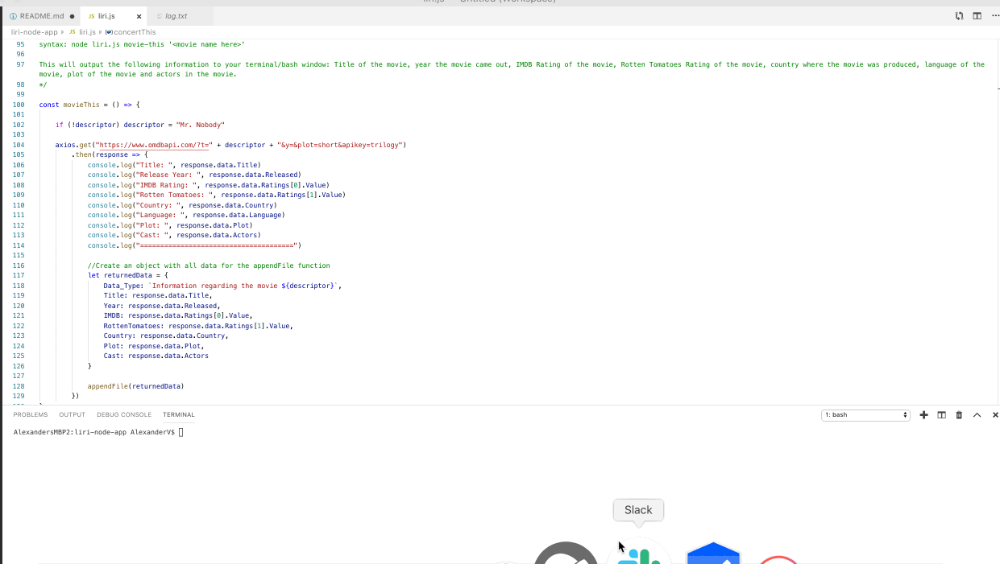

# Liri-Node-App

## What The Project Does

#### The Liri-Node-App is a node.js application that makes various API calls and returns relevant information based on user input. It uses both the axios and spotify packages and makes calls to the Bands In Town API, the OMDB API and the Spotify API.

#### There are four commands and each commmand requires an input. If no input is provided, some functions will return a default artist or movie. All commands will also append a string version of the data to a separate log.txt file.

    1. Concert-this: This command searches the Bands in Town Artist Events API for a ** BAND ** and render the following information about each event to the terminal =>
        a. Name of the venue
        b. Venue location
        c. Date of the Event (used moment to format this as "MM/DD/YYYY")

    2. Spotify-this-song: This command uses the Spotify API and will show the following information about the song you enter in your terminal =>
        a. Artist(s)
        b. The song's name
        c. A preview link of the song from Spotify
        d. The album that the song is from. 
        e. If no song is provided then the program will default to "The Sign" by Ace of Base.

    3. Movie-this: This command will also use the axios package and call the OMDB API in order to output the following information =>
        a. Title of the movie
        b. Year the movie came out
        c. IMDB Rating of the movie
        d. Rotten Tomatoes Rating of the movie 
        e. Country where the movie was produced
        f. Language of the movie
        g. Plot of the movie
        h. Actors in the movie
        i. If no movie is provided then the program will default to "Mr. Nobody" 

    4. Do-what-it-says: This uses the fs Node package. LIRI will take the text inside of random.txt and then use it to call one of LIRI's commands. Initially, it should run spotify-this-song for "I Want it That Way".

 
#### Do-What-It-Says Command

#### Concert-This Command

#### Movie-This Command

#### Spotify-This-Song Command

